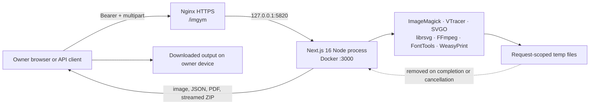

# Project Shape

## System statement

Oh My Img is a private, self-hosted transformation service for web images, general design assets, SVG, animated GIF replacements, font subsets, and Markdown-to-PDF output. It has no account system and no durable asset store. One owner uses a browser UI or the versioned HTTP API with a shared Bearer key.

## Runtime context



There is no database, queue service, user table, object storage, CDN asset store, or background worker. The in-process job gate is sufficient only for the current single-container deployment.

## Deployment container view

| Container or boundary | Responsibility |
| --- | --- |
| Owner browser | Selects files, keeps the API key in `localStorage.ohmyimgapikey`, runs sequential batch state, previews Blob URLs, saves output. |
| Nginx | Terminates HTTPS, preserves `/imgym`, forwards `Authorization`, permits 12 MiB request bodies, disables buffering for streamed results, uses 100-second send/read timeouts. |
| Next.js application | Serves the UI, authenticates every conversion request, applies multipart and concurrency admission, validates options, coordinates engines, shapes responses. |
| Native engines | Perform decoding, encoding, metrics, tracing, SVG rendering, video encoding, font subsetting, and PDF generation. |
| Temporary filesystem | Holds request-local intermediates for ZIP, media, raster metrics, and PDF rendering; never acts as durable product state. |

The fixed public base path is `/imgym`. `next.config.ts` also selects standalone output and leaves VTracer external so its adjacent WASM file remains discoverable at runtime.

## Source tree

```text
src/app/
  page.tsx                 one-page application shell
  api/health/              public configuration health check
  api/v1/*                 authenticated Node.js Route Handlers

src/components/
  image-workspace.tsx      top-level navigation and API-key input
  *-workspace.tsx          workflow-specific client state and requests
  ui/                      shared presentational primitives

src/hooks/
  use-local-api-key.ts     owner-browser key persistence
  use-object-url.ts        Blob URL lifecycle

src/lib/api/
  access.ts                key validation and timing-safe comparison
  client.ts                base-path and Bearer client helper
  multipart.ts             bounded multipart reader and field allowlist
  job-gate.ts              process-local concurrency admission
  download.ts              streamed-to-disk or Blob ZIP save

src/lib/image/             shared batch and animation helpers
src/lib/raster/            static raster validation, crop, encoding, metrics
src/lib/vector/            tracing, cleanup, SVGO, rendering, similarity
src/lib/web-assets/        inspection, responsive packs, snippets, ZIP
src/lib/asset-recipes/     image/icon/palette/social/media/font recipes
src/lib/document/          Markdown, semantic HTML, PDF process boundary

scripts/                   calibration, asset audit, PDF renderer
deploy/                    Nginx path routing
calibration/               private-corpus instructions and ignored outputs
test/fixtures/             small committed integration fixtures
docs/wiki/                 current system memory
docs/*.md                  detailed designs, research, and dated reviews
```

## Standard request lifecycle

All conversion routes follow the same ownership order:

1. Create a request ID.
2. Validate server key configuration and Bearer authorization.
3. Acquire a process-local job permit; return 429 if unavailable.
4. Read a size-bounded multipart body and reject unexpected or duplicate fields.
5. Validate magic bytes, decoded dimensions, options, and workflow-specific limits.
6. Run an in-process library or a shell-free child process with bounded time and output.
7. Return JSON, one file, or a bounded streamed ZIP with `Cache-Control: no-store`.
8. Release the permit and remove request-local temporary files, including cancellation paths.

Route Handlers own HTTP details. `src/lib/**` owns validation and transformation. Components own browser state. Keep those directions one-way.

## Security and privacy boundaries

- `OHMYIMG_API_KEY` is mandatory, 32–256 characters, and compared through SHA-256 digests with `timingSafeEqual`.
- Authentication occurs before multipart parsing or image decoding.
- The UI key is convenient owner-only storage, not a multi-user login or secure HttpOnly session.
- Native commands use argument arrays and `shell: false`; filenames and arbitrary codec arguments are not interpolated into commands.
- Input types are verified by signatures/decoded structure rather than extension alone.
- Image size, decoded pixels, subprocess time, captured output, generated output, ZIP entry count, and ZIP uncompressed size are bounded.
- Direct SVG removes executable/external content and is never inserted as inline DOM.
- Markdown rejects raw HTML, remote resources, arbitrary CSS, and JavaScript before the isolated PDF renderer.
- Outputs use `no-store`; uploaded assets and generated artifacts are not retained by the service.

## External runtime dependencies

| Dependency | Owned work |
| --- | --- |
| ImageMagick 7 | Raster decode/encode, crop, color management, metadata removal, metrics, image recipes, HEIC. |
| VTracer WASM | Raster-to-SVG tracing. |
| SVGO 4 | Conservative SVG optimization and hardening. |
| librsvg / `rsvg-convert` | SVG rasterization for similarity gates. |
| FFmpeg | Bounded GIF-to-VP9 WebM and H.264 MP4 conversion. |
| FontTools + Brotli | WOFF2 subsetting and Unicode-range handoff. |
| WeasyPrint 68.1 + Noto CJK | Semantic paged PDF/UA-1 generation. |
| Poppler | PDF integration assertions in the builder; not installed in the final runtime. |

The Dockerfile is the canonical dependency manifest. Host tool installations are developer conveniences and may not be feature-complete.

## Stable invariants

1. The public base path remains `/imgym`; Nginx must not strip it.
2. No conversion route is anonymous.
3. The server does not become a durable asset manager by accident.
4. User input never becomes a shell command or unbounded native-process argument.
5. Automatic optimization returns the smallest candidate only after versioned quality gates pass.
6. Metadata and color handling are explicit; file-size wins do not silently override correctness.
7. Stream ownership includes permit release and temporary-file cleanup.
8. Docker must test before it builds the deployable image.
